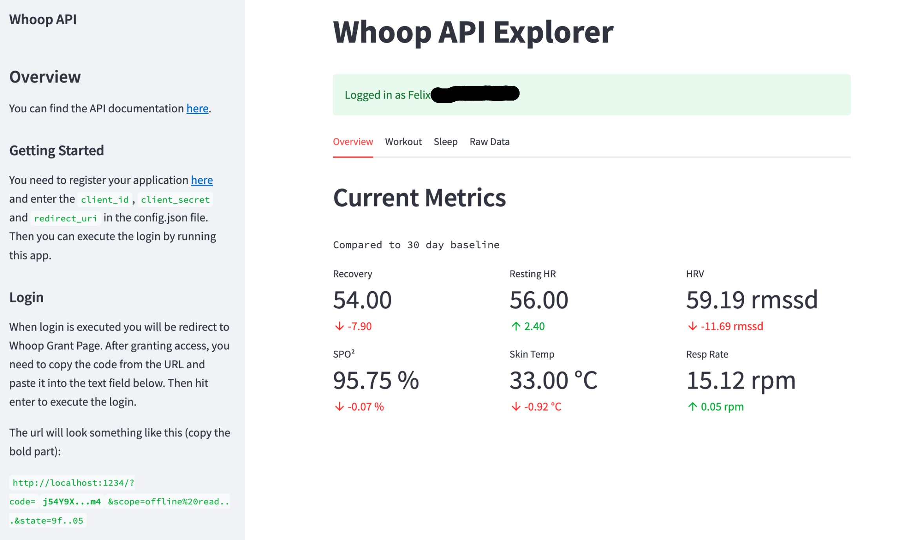

# Whoop Python Client

[](https://github.com/felixnext/whoopy/actions/workflows/python-package.yml)
[](https://badge.fury.io/py/whoopy)
[](https://pypi.org/project/whoopy/)
[](https://opensource.org/licenses/MIT)

An unofficial Python client for the [WHOOP API](https://developer.whoop.com/) with support for both OAuth and Personal API keys. Features async/await support, automatic token refresh, and comprehensive data models.

## Features

- 🚀 **Full API v2 Support** - Access cycles, sleep, recovery, workouts, and user data
- ⚡ **Async/Await Support** - High-performance async client with synchronous wrapper
- 🔄 **Automatic Token Management** - Token refresh and persistence out of the box
- 📊 **Pandas Integration** - Export data directly to DataFrames for analysis
- 🛡️ **Type Safety** - Comprehensive type hints and Pydantic models
- 🔁 **Retry Logic** - Built-in retry with exponential backoff
- 🐍 **Python 3.10+** - Modern Python with the latest features

## Installation

### Using pip

```bash
pip install whoopy
```

### Using uv (recommended)

```bash
uv add whoopy
```

### Development Installation

```bash
# Clone the repository
git clone https://github.com/felixnext/whoopy.git
cd whoopy

# Install with uv (recommended)
uv sync --all-extras

# Or install with pip
pip install -e ".[dev]"
```

## Quick Start

### 1. Get Your API Credentials

1. Go to the [WHOOP Developer Dashboard](https://developer-dashboard.whoop.com/)
2. Create a new application
3. Note your `client_id`, `client_secret`, and set `redirect_uri` to `http://localhost:1234`

### 2. Create Configuration

Create a `config.json` file:

```json
{
    "client_id": "YOUR_CLIENT_ID",
    "client_secret": "YOUR_CLIENT_SECRET",
    "redirect_uri": "http://localhost:1234"
}
```

### 3. Run the Example

```bash
# Run the example script
uv run python -m tools.example

# Or if using standard Python
python -m tools.example
```

## Usage Examples

### Synchronous Usage (Recommended for Beginners)

```python
from whoopy import WhoopClient
from datetime import datetime, timedelta

# Initialize client (loads credentials from config.json)
client = WhoopClient.from_config()

# Get user profile
profile = client.user.get_profile()
print(f"Hello, {profile.first_name}!")

# Get recent recovery data
recoveries = client.recovery.get_all(
    start=datetime.now() - timedelta(days=7),
    end=datetime.now()
)

for recovery in recoveries:
    print(f"Recovery: {recovery.score.recovery_score}%")

# Export to pandas DataFrame
df = client.sleep.get_dataframe(
    start=datetime.now() - timedelta(days=30)
)
print(df.describe())
```

### Asynchronous Usage (Better Performance)

```python
import asyncio
from whoopy import WhoopClientV2

async def main():
    # Use async context manager
    async with WhoopClientV2.from_config() as client:
        # Fetch multiple data types concurrently
        profile, cycles, sleep = await asyncio.gather(
            client.user.get_profile(),
            client.cycles.get_all(limit_per_page=10),
            client.sleep.get_all(limit_per_page=10)
        )
        
        print(f"User: {profile.first_name}")
        print(f"Recent cycles: {len(cycles)}")
        print(f"Recent sleep: {len(sleep)}")

# Run the async function
asyncio.run(main())
```

### Authentication Options

```python
# Option 1: Interactive OAuth flow (opens browser)
client = WhoopClient.auth_flow(
    client_id="YOUR_CLIENT_ID",
    client_secret="YOUR_CLIENT_SECRET",
    redirect_uri="http://localhost:1234"
)

# Option 2: From existing token
client = WhoopClient.from_token(
    access_token="YOUR_ACCESS_TOKEN",
    refresh_token="YOUR_REFRESH_TOKEN",
    client_id="YOUR_CLIENT_ID",
    client_secret="YOUR_CLIENT_SECRET"
)

# Option 3: From config files (recommended)
client = WhoopClient.from_config()

# Save credentials for later use
client.save_token(".whoop_credentials.json")
```

## Available Data Types

### User Data
- Profile information
- Body measurements

### Physiological Data
- **Cycles** - Daily physiological cycles
- **Recovery** - Recovery metrics including HRV, resting heart rate
- **Sleep** - Sleep stages, efficiency, and performance
- **Workouts** - Exercise activities with strain and heart rate data

## Development

### Setup Development Environment

```bash
# Clone the repository
git clone https://github.com/felixnext/whoopy.git
cd whoopy

# Install with development dependencies
uv sync --all-extras
```

### Running Tests

```bash
# Run all tests
uv run pytest

# Run with coverage
uv run pytest --cov=whoopy

# Run specific test file
uv run pytest tests/test_client.py
```

### Code Quality

```bash
# Run linting
uv run ruff check .

# Format code
uv run ruff format .

# Type checking
uv run mypy whoopy
```

### Building the Package

```bash
# Build wheel and sdist
uv build

# Install locally to test
uv pip install dist/whoopy-*.whl
```

## Data Explorer Tool

The package includes a Streamlit-based data explorer for visualizing your WHOOP data:

```bash
# Install explorer dependencies
uv sync --extra explorer

# Run the explorer
cd tools/explorer && uv run streamlit run explorer.py
```

### Explorer Features
- Interactive data visualization
- Date range filtering
- Export to CSV/Excel
- Recovery, sleep, and workout analysis



## API Reference

### Client Classes

- `WhoopClient` - Synchronous client (v2 API)
- `WhoopClientV2` - Async client (v2 API)
- `WhoopClientV1` - Legacy v1 client

### Main Methods

```python
# User data
profile = client.user.get_profile()
measurements = client.user.get_body_measurements()

# Cycles (daily summaries)
cycle = client.cycles.get_by_id(12345)
cycles = client.cycles.get_all(start="2024-01-01", end="2024-01-31")

# Sleep
sleep = client.sleep.get_by_id("uuid-here")
sleep_df = client.sleep.get_dataframe(start="2024-01-01")

# Recovery
recovery = client.recovery.get_for_cycle(12345)
recoveries = client.recovery.get_all()

# Workouts
workout = client.workouts.get_by_id("uuid-here")
workouts = client.workouts.get_by_sport("running", start="2024-01-01")
```

## Contributing

Contributions are welcome! Please feel free to submit a Pull Request. For major changes, please open an issue first to discuss what you would like to change.

### Development Workflow

1. Fork the repository
2. Create your feature branch (`git checkout -b feature/amazing-feature`)
3. Make your changes and add tests
4. Run tests and linting (`uv run pytest && uv run ruff check`)
5. Commit your changes (`git commit -m 'Add amazing feature'`)
6. Push to the branch (`git push origin feature/amazing-feature`)
7. Open a Pull Request

## License

This project is licensed under the MIT License - see the [LICENSE](LICENSE) file for details.

## Disclaimer

This is an unofficial client for the WHOOP API. It is not affiliated with, endorsed by, or in any way officially connected to WHOOP. Use at your own risk.

## Support

- 📖 [Documentation](https://github.com/felixnext/whoopy#readme)
- 🐛 [Issue Tracker](https://github.com/felixnext/whoopy/issues)
- 💬 [Discussions](https://github.com/felixnext/whoopy/discussions)

## Acknowledgments

- Thanks to WHOOP for providing the [official API](https://developer.whoop.com/)
- Built with [aiohttp](https://docs.aiohttp.org/) and [pydantic](https://docs.pydantic.dev/)